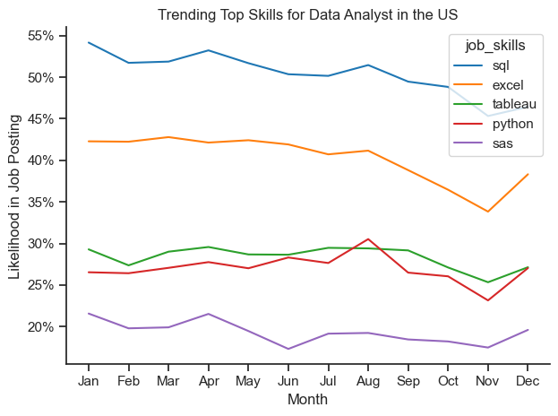
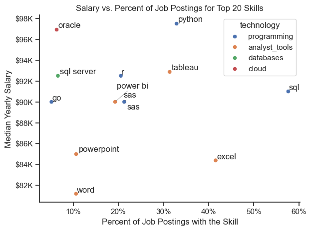

# Overview
Data Analyst Job Market Analysis
Overview
Welcome to my analysis of the data job market, with a specific focus on Data Analyst roles. This project was developed to better understand the evolving landscape of the data industry and identify the skills and trends that shape career opportunities in the field.
Using a dataset sourced from Luke Barousse’s Python course, this project explores job titles, salaries, locations, and required technical skills within the data job market. Through a series of Python-based analyses, I investigated key industry questions related to skill demand, salary trends, and the relationship between compensation and skill specialization.
The goal of this project is to provide actionable insights for aspiring and current data professionals seeking to make informed career decisions.

## Project Questions
The analysis focuses on answering the following key questions:
1.	What are the most in-demand skills for the top three most popular data roles?
2.	How are skill demands trending for Data Analysts?
3.	How well do Data Analyst roles and skills pay?
4.	What are the optimal skills for Data Analysts to learn based on both demand and salary potential?


## Tools and Technologies Used
This project utilized several industry-standard tools and technologies for data analysis, visualization, and version control:
Programming Language
•	Python — The primary language used for data analysis and visualization.
Python Libraries
•	Pandas — Used for data cleaning, transformation, and analysis.
•	Matplotlib — Used to create data visualizations.
•	Seaborn — Used for advanced statistical visualizations and enhanced chart styling.
Development Environment
•	Jupyter Notebook — Used for running analysis workflows, combining code, notes, and visual outputs in an interactive environment.
•	Visual Studio Code — Used as the primary code editor and development environment.
Version Control
•	Git & GitHub — Used for version control, project management, and sharing the analysis publicly.


## Data Preparation and Cleaning
Before conducting the analysis, the dataset underwent several preparation and cleaning steps to ensure consistency, accuracy, and usability. These steps included:
•	Handling missing values
•	Removing duplicate entries
•	Standardizing data formats
•	Filtering relevant job roles and salary information
•	Preparing skill-related data for analysis
Proper data cleaning was essential for generating reliable insights throughout the project.


## The Analysis

### 1. What are the most demanded skills for the top 3 most popular data roles?

To find the most demanded skills for the top 3 most popular data roles. I filtered out those positions by which ones were the most popular, and got the top 5 skills for these top 3 roles. This query highlights the most popular job titles and their top skills, showing which skills i should pay attention to depending on the role I`m targeting

iew my notebook with detailed steps here: [Initial_Project.ipynb](1_Basics/Initial_Project.ipynb)


### Visualize Data

```python
fig, ax = plt.subplots(len(job_titles), 1)


for i, job_title in enumerate(job_titles):
    job_data = df_skills_percent[df_skills_percent['job_title_short'] == job_title].head(5)
    
    sns.barplot(data=job_data, y='job_skills', x='skill_percent', ax=ax[i], hue='skill_percent', palette='dark:b_r', legend=False)
    
plt.show()
```
### Results


#### Insights

- Python is the most versatile skill, highly demanded across all the three roles, but most prominently for Data Scientist (72%) and Data Engineers (65%).
- SQL is the most requested skill for Data Analyst and Data Scientist, with it in over half the job Postings for both roles. For Data Engineers, Pythoon is the most sought-after skill, appering in 68% of job postings.
- Data Engineers require more specialized technical skills (AWS, Azure, Spark) compared to Data Analysts and Data Scientist who are expected to be proficient in more general data management and analysis tools(Excel, Tableau)


### 2. How are in-demand skills trending for Data Analyst

#### Visualize Data

```python
sns.lineplot(data=df_Plot, dashes=False, palette='tab10')
sns.despine()
sns.set_theme(style='ticks')
plt.title('Trending Top Skills for Data Analyst in the US')
plt.ylabel('Likelihood in Job Posting')
plt.xlabel('Month')
from matplotlib.ticker import PercentFormatter
plt.gca().yaxis.set_major_formatter(PercentFormatter(decimals=0))
plt.show()
```



Bar graph visualizing the trend top skills for data analyst in the US.

### Insights:
- SQL remains the most consistently demanded skill throughout the year, although it shows a gradual  decrease in demand
- Excel experienced a significant increase in demand starting around November to December
- Both Python and Tableau show relatively stable demand throughout the year with some fluctuations but remain essential skills for data Analysts.


### 3. How well do jobs and skills pay for Data
#### Visualize Data

```python
sns.boxplot(data=df_top_jobs, x='salary_year_avg', y='job_title_short', order=job_order)
sns.set_theme(style='ticks')
ticks_x = plt.FuncFormatter(lambda y, pos: f'${int(y/1000)}K')
plt.gca().xaxis.set_major_formatter(ticks_x)
plt.show()
```
### Highest Paid & Most Demanded Skills for Data
#### Results
in-demand skills for data analyst in the US:


*Box plot visualizing the salary distribution for the top 6 data job titles.*

### Insights
- Senior Data Scientist positions tend to have the highest salary potential, with up to $600k, indicating the high value placed on advanced data skills and experience in the industry.

- Senior Data Engineer and Senior Data Scientist roles show a considerable number of outliers on the higher end of the salary spectrum, suggesting that exceptional skills or circumstances can lead to high pay in these roles. In contrast, Data Analyst roles demostrate more consistency in salary, with fewer outliers.

- The median salaries increase with the seniority and specialization of the roles. Senior roles(Senior Data Scientist, Senior Data Engineer) not only have higher median salaries but also larger differences in typical salaries, reflecting greater variance in compensation as responmsibilities increase.

### 4. What is the most optimal skill to learn for Data Analyst
#### Visualize Data

```python
sns.scatterplot(data=df_merge, x='percent', y='Median_Salary', ax=ax, hue='technology')
sns.despine()
sns.set_theme(style='ticks')
```
### Results

*A scatter plot visualizing the most optimal skills (high paying & high demand) for data analysts in the US*


### Insights:
- The scatter plot shows that most of the `programming` skills (coloures blue) tend to cluster at higher salary levels compared to other categories, indicating that programming expertise sight offer greater salary benefits within the data analytics field.

- Analysts tools (coloured green), including Tableau and Power BI, are prevalent in Job postings and offer competitive salaries, showing that visualization and Data analysis software are crucial foe current data roles. This category not only has good salaries but is also versatile across different types of data tasks.

- The database skills (colored orange), such as Oracle and SQL server, are associated with some of the highest salaries among data analyst tools. This indicates a sinificant demand and valuation for data management and manipulation expertise in the Industry.


## What I Learned
Throughout this project, I strengthened both my analytical thinking and technical capabilities in data analysis.
### Key Takeaways
- Advanced Python Skills
I improved my proficiency in using Python libraries such as Pandas, Matplotlib, and Seaborn for efficient data analysis and visualization.

- Importance of Data Cleaning
I learned that accurate analysis depends heavily on thorough data preparation and cleaning.
- Strategic Skill Evaluation
Understanding the relationship between skill demand, salary levels, and job availability provides valuable insight for career planning in data analytics.
- Data Visualization Techniques
I developed better approaches for presenting complex datasets through clear and effective visual storytelling.


## Insights
This project revealed several important insights about the data analyst job market:
- Skill Demand and Salary Correlation
There is a strong relationship between high-demand technical skills and salary levels. Specialized skills such as Python, SQL, and Oracle are often associated with higher-paying roles.
- Evolving Market Trends
The demand for technical skills changes over time, reflecting the dynamic nature of the data industry. Staying updated with industry trends is essential for long-term career growth.
Economic Value of Technical Skills
- Identifying skills that are both highly demanded and well-compensated can help data professionals prioritize learning paths that maximize career opportunities and earning potential.


## Challenges Faced
Like many real-world data projects, this analysis came with several challenges:
- Data Inconsistencies:
Handling incomplete or inconsistent data required careful preprocessing to maintain analytical accuracy.
- Complex Visualizations:
Designing visualizations that clearly communicated insights from large datasets required thoughtful planning and iteration.
- Balancing Depth and Scope:
Maintaining a balance between detailed analysis and broader market insights was essential to keep the project both comprehensive and focused.


## Conclusion
- This project provided valuable insights into the current state of the data analyst job market and the technical skills shaping the industry. The analysis not only improved my technical abilities in data analysis and visualization but also enhanced my understanding of market-driven career development.
- As the data industry continues to evolve, continuous learning and ongoing market analysis remain essential. This project serves as a strong foundation for future explorations into data careers, salary trends, and skill optimization in the analytics field.
